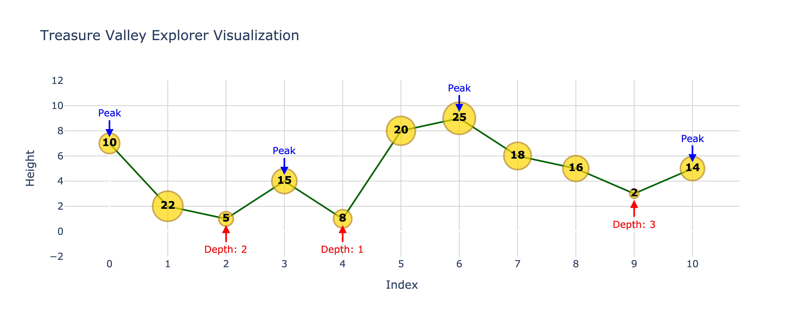

# Homework 2: Treasure Valley Explorer (25 points)

## :sparkles: Lore: The Depths of Numerica's Riches

Welcome back to the mystical land of Numerica! The First Valley Explorers have made groundbreaking discoveries, revealing that the landscape is far more complex and treasure-laden than initially thought. Each landform now holds not just a height, but also a hidden treasure value. Moreover, the concept of "depth" has emerged, indicating how far a valley point is from the nearest peak.

As Numerica's premier cartographer, you've been tasked with upgrading your magical map, now called `TreasureValleyExplorer`, to navigate this intricate landscape. Your new map must not only identify valleys but also track their depths and the values of the treasures they hold. The Data Lords of Numerica have become even more cunning, altering the landscape based on the depths of the valleys and the value of their treasures.

## :scroll: Problem Description

Implement a Java class called `TreasureValleyExplorer` that operates on a landscape of Numerica, where each landform has a height and a treasure value. Some methods return an `IntPair` object, which is a custom class that contains two integers. You can find the definition of `IntPair` in the starter code.

The class should have a constructor as below:

`TreasureValleyExplorer(int[] heights, int[] values)`: Constructor that initializes the magical map with the given landscape of Numerica, where `heights` represent the elevation of each landform and `values` represent the treasure value at each landform.

The class should have the following methods:

1. `boolean insertAtMostValuableValley(int height, int value, int depth)`: Inserts a new landform with the given height and value at the position of the most valuable valley point at the specified depth. Returns `true` if the insertion is successful (when it is possible to insert at the specified depth), `false` otherwise.

2. `boolean insertAtLeastValuableValley(int height, int value, int depth)`: Similar to `insertAtMostValuableValley`, but inserts at the position (before) of the least valuable valley point at the specified depth. Returns `true` if the insertion is successful, `false` otherwise.

3. `IntPair removeMostValuableValley(int depth)`: Removes the most valuable valley point at the specified depth.

4. `IntPair removeLeastValuableValley(int depth)`: Similar to `removeMostValuableValley`, but removes the least valuable valley point at the specified depth.

5. `IntPair getMostValuableValley(int depth)`: Returns the height and value of the most valuable valley point at the specified depth as an `IntPair`. If no valley point exists at the specified depth, the method should return `null`.

6. `IntPair getLeastValuableValley(int depth)`: Similar to `getMostValuableValley`, but returns the height and value of the least valuable valley point at the specified depth as an `IntPair`. If no valley point exists at the specified depth, the method should return `null`.

7. `int getValleyCount(int depth)`: Returns the number of valley points at the specified depth.

8. `boolean isEmpty()`: Returns true if the entire landscape is excavated (i.e., there are no landforms left), false otherwise.

The depth of a valley point is defined as the number of consecutive downward steps from the nearest left peak. Peaks (local maxima) have a depth of 0.

For example, in the landscape with heights [1, 2, 5, 7, 6, 5, 3, -1, 9]:
- The depths would be [0, 0, 0, 0, 1, 2, 3, 4, 0]
- 7 has a depth of 0 (it's a peak)
- 6 has a depth of 1
- 3 has a depth of 3
- -1 has a depth of 4

**Definitions:**
- A __descend point__ is a landform that can be part of a descend sequence. In other words, its height is lower than its immediate predecessor, or higher than its immediate successor. <br> E.g. 5, 3 and 2 are descend points in [1, 5, 3, 2].
- An __ascend point__ is a landform that can be part of an ascend sequence. In other words, its height is higher than its immediate predecessor, or lower than its immediate successor. <br> E.g. 1 and 5 are ascend points in [1, 5, 3, 2].
- A __valley__ is a landform that is lower than its neighboring landforms.
- A __peak__ is a landform that is higher than its neighboring landforms.
- Peaks and valleys are both descend points and ascend points at the same time.
- The __depth__ of a landform on a descend sequence is the number of consecutive downward steps from the nearest left peak, with a peak having a depth of 0. The notion of depth is not applicable to landforms that are strictly on an ascend sequence.

Formally, let $A$ be the $0$-indexed array of $n$ distinct integers, and $A_{i}$ be the element at index $i$.

An element $A_{i}$ is a valley point if and only if:
- For $n = 1$: $A_{0}$ is a valley point
- For $i = 0$: $A_{i} < A_{i+1}$
- For $i = n-1$: $A_{i} < A_{i-1}$
- For $0 < i < n-1$: $A_{i} < A_{i-1}$ and $A_{i} < A_{i+1}$

An element $A_{i}$ is a peak point if and only if:
- For $n = 1$: $A_{0}$ is a peak point
- For $i = 0$: $A_{i} > A_{i+1}$
- For $i = n-1$: $A_{i} > A_{i-1}$
- For $0 < i < n-1$: $A_{i} > A_{i-1}$ and $A_{i} > A_{i+1}$

Let $D(i)$ be the depth of a descend point at index $i$.
- $D(0) = 0$
- $D(i) = 0$ if $A_{i}$ is a peak point
- $D(i) = D(i-1) + 1$ if $A_{i} < A_{i-1}$

**Important Note:** At any given time, it is guaranteed that all valley points at a specific depth will have unique treasure values. This means there will never be ties for the most or least valuable valley at a given depth.

## :briefcase: Requirements

1. Implement the `TreasureValleyExplorer` class in `TreasureValleyExplorer.java`.
2. The class should have a constructor that takes two arrays of integers: heights and values.
3. Implement all the methods described in the problem description.
4. Handle edge cases and maintain the landscape's integrity after operations.
5. Ensure efficient implementation of all operations.

## :footprints: Example Expedition

Consider the following initial landscape:

```
Initial Landscape:
Index:      [ 0  1   2  3   4   5   6   7   8  9  10]
Heights:    [ 7, 1,  4, 1,  8,  9,  2,  6,  5, 3,  5]
Values:     [10, 5, 15, 8, 20, 25, 12, 18, 16, 2, 14]
Depths:     [ 0, 1,  0, 1,  0,  0,  1,  0,  1, 2,  0]
```


1. `getMostValuableValley(1)` returns an `IntPair` (2, 12) with height 2 and value 12 (index 6, depth 1)

2. `removeMostValuableValley(1)` removes the landform at index 6 and return an IntPair (height 2, value 12)
```
New landscape:
Index:      [ 0,  1,  2,  3,  4,  5,  6,  7,  8,  9]
Heights:    [ 7,  1,  4,  1,  8,  9,  6,  5,  3,  5]
Values:     [10,  5, 15,  8, 20, 25, 18, 16,  2, 14]
Depths:     [ 0,  1,  0,  1,  0,  0,  1,  2,  3,  0]
```


3. `insertAtLeastValuableValley(2, 22, 1)` inserts a new landform of height 2 with value 22 before the least valuable valley at depth 1 (index 1), returning `true`.
```
New landscape:
Index:      [ 0,  1,  2,  3,  4,  5,  6,  7,  8,  9, 10]
Heights:    [ 7,  2,  1,  4,  1,  8,  9,  6,  5,  3,  5]
Values:     [10, 22,  5, 15,  8, 20, 25, 18, 16,  2, 14]
Depths:     [ 0,  1,  2,  0,  1,  0,  0,  1,  2,  3,  0]
```


4. `insertAtLeastValuableValley(10, 9, 4)` attempts to insert a new landform of height 10 with value 9 at the least valuable valley at depth 4, but since it's not possible, it returns `false`.

5. `getLeastValuableValley(5)` returns `null` since there is no valley at depth 5.
6. `getLeastValuableValley(3)` returns `(3, 2)`, the only valley at depth 3 (index 9).

Final operations output sequence looks like:
```
[(2, 12), (2, 12), true, false, null, (3, 2)]
```

## :bulb: Hints 
1. Make your own Valley class that contains depth.
2. To fulfil the runtime requirements, you should create and maintain two linked lists: one for the landscape, and one for valleys. 
3. You should store valleys of the same depth in a sorted structure. 

## :envelope: Submission Details

For this assignment, you will submit your `TreasureValleyExplorer.java` file and any additional files you create through Gradescope. 

__Submission link:__ [https://www.gradescope.com/courses/544834](https://www.gradescope.com/courses/844378)

__Deadline:__ Oct 15th, 2024 at 11:59 PM EST (2 weeks from the release of the assignment).

__Late Submission Policy:__ Late submissions will not be accepted.

## :bar_chart: Evaluation:

### Procedure

- __Initialization:__ The `TreasureValleyExplorer` object is initialized with two arrays representing heights and values of the initial landscape.
- __Operations:__ The methods can be invoked in any arbitrary order, as long as they are valid.
- __Assumptions:__ It is guaranteed that all valley points at a specific depth will have unique treasure values, and no two consecutive landforms will have the same height at any given point. The size of the landscape, the number of total landforms, at any given time, will not exceed 100,000.
- __Testing:__ We will test your implementation with various test cases, each containing different landscapes and operations. Based on how many and which test cases your implementation passes, we will assign you a score between 0 and 25 points.

### Criteria

- __Correctness:__ Does the implementation correctly handle all operations on the landscape?
- __Efficiency:__ Does the implementation have a reasonable time and space complexity?
- __Time Complexity:__ Given an initial landscape with $N$ landforms and $Q$ queries (operations), the entire procedure should be completed in $O((N + Q) \log N)$ time complexity for full credit.
### Partial Credits
You can get partial credits for passing a subset of the test cases if you meet at least one of the below conditions:
- Correct implementation of insert operations.
- Correct implementation of remove operations.
- Correct implementation of get operations.

## :rocket: Starter Code

Begin your expedition with this [`TreasureValleyExplorer.java`](TreasureValleyExplorer.java) file. Make sure to adhere to the requirements and constraints provided in the problem description, and not use any Java standard collection libraries.

### Evaluation Script

We will use a script similar to [`Evaluator.java`](Evaluator.java) to evaluate the correctness and efficiency of your implementation. You may run the script locally to evaluate your implementation.

Steps to run the evaluation script:

```bash
# Make sure you have Java installed on your computer
java -version

# Navigate to the problems/hw2 directory
cd problems/hw2

# Compile the Evaluator.java file
javac Evaluator.java TreasureValleyExplorer.java

# Run the Evaluator file with the provided sample test case
java Evaluator sample_tc.txt

# You can create your own test cases to test your implementation
```

## Frequently Asked Questions

Q: What version of Java with what packages will the autograder compile submitted code?

A: Your solution will be compiled using JDK 17 with no additional libraries or packages.

Q: How do we submit our local files to Gradescope for project submissions?

A: Submit your solution "TreasureValleyExplorer.java" and any additional java files you produce directly to the Gradescope submission page.

Q: Is there a specific IDE that we have to use or any recommended IDEs?

A: No specific IDE is required, use whichever one you prefer.
